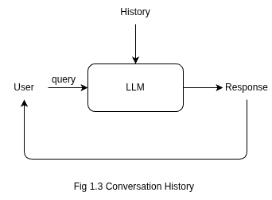
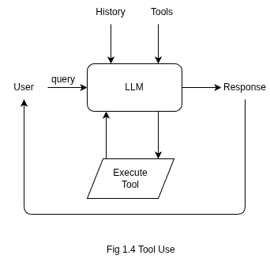
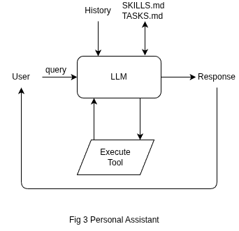

# LLMs In Loop
- From Chatbot to Autonomous Agent: Everything is an LLM in a Loop

In this article we progressively evolve a single loop into real systems:

1. **Inference** → basic LLM response
2. **A chatbot** → Conversation history and the loop
3. **A coding agent** → tools to let it read and edit files *(minimal Claude-Code–style CLI)*
4. **An autonomous assistant** → Add scheduled tasks + messaging via telegram *(minimal OpenClaw-style system)*

Note: Code snippets in this article are pseudo-code for clarity, The complete working implementation is available in the accompanying notebook: [walkthrough.ipynb](https://github.com/Aananda-giri/llm-in-loop-blog/blob/master/walkthrough.ipynb)

## 1. Introduction
Modern AI applications look very different: chatbots, coding agents, and autonomous assistants. But internally they all share the same architecture: a loop around a language model.

In this article we will start from a single function and progressively grow it into an autonomous agent.

### 1.1 LLM Inference:

An LLM does not *think*, search, or reason in the traditional sense.  
It performs a single operation:

> Given text, predict what text should come next.

This process is called **inference**.

A *prompt* is simply the text we provide as input, and the model continues it.  When you ask a question, you are not triggering a special “question answering mode”: you are just giving it a sentence that statistically expects an answer to follow.

Because of this, every AI application we build must ultimately reduce to one primitive function:


Everything else: memory, tools, autonomy will be built around repeatedly calling this function.
For the implementation in this article we will use gemini-2.5 model from [Google Gemini](https://ai.google.dev/gemini-api/docs) project, but any LLM provider can be substituted with minimal changes.  
The concrete API details are not important; what matters is that we can ask the model for a continuation of text.


Here is the pseudocode for a basic `respond` function, later we will update it to add history and tool calling ability.

```
def respond(query):
    response = <ask model to continue the text>
    return response
```

And here is the example interaction:

```
User: What are the must-see places in Pokhara?
AI: Phewa Lake, Sarangkot, ... 
```

The runnable implementation is available in [walkthrough.ipynb](https://github.com/Aananda-giri/llm-in-loop-blog/blob/master/walkthrough.ipynb).

> Note: you will need an API key from [Google AI Studio](https://aistudio.google.com/app/api-keys) and place it in `.env`.


### 1.2 The Loop (Birth of a Chatbot)


Right now our program can answer a single question once.

But conversations are not single questions: they are **repeated interactions**.

So instead of calling the model once, we put it in a loop, so we can call it repeatedly:

```
while True:
    query = input("User: ")
    response = respond(query)
    print(response)
```

Surprisingly, this tiny change already creates something recognizable: a chatbot.

```
User: What are the must-see places in Pokhara?
LLM: Phewa Lake, World Peace Pagoda, Sarangkot, ...

User: I prefer peaceful spots: can you adjust the plan?
LLM: ... where you're planning to go?
```

But, the model fails to correctly address the follow-up.

Why?

Because every iteration of the loop is independent.
The model only sees the **current message**, not the conversation.

To the model, the second question looks like it appeared out of nowhere.

So the next step is obvious:

> If conversations require memory, we must store the past and send it back to the model each time.

We will call this stored past the **history**.


### 1.3 Conversation History (Memory Emerges)



To hold a conversation, the model must see previous messages every time it responds.

Since the model is stateless and lacks internal memory. So we will create a list called `history` to store the dialogue. This context is then passed back to the model with each subsequent call to maintain continuity.

We call this stored dialogue the **history**.

```
history = []

while True:
    query = input("User: ")
    history.append(query)

    response = respond(history)
    history.append(response)

    print(response)
```

Now the model receives not just the latest question, but the entire conversation so far.

```
User: What are the must-see places in Pokhara?
LLM: Phewa Lake, World Peace Pagoda, Sarangkot, ...

User: I prefer peaceful spots: can you adjust the plan?
LLM: For peaceful spots in Pokhara, consider visiting World Peace Pagoda.
```

Nothing inside the model changed.

We did not upgrade the architecture.  
We did not fine-tune it.

We simply **fed the conversation history back to the LLM on every inference call.**.

And from that, memory appeared.


### 1.4 Tools: Agency Appears


So far our system can **talk**.

It remembers the conversation and produces coherent replies.
But it is still trapped inside text.

Ask it something simple:

> *What is the weather in Pokhara right now?*

The model will confidently answer: but it is guessing.
Because the model cannot see the internet.
It only predicts tokens.

A language model has only one ability:

> generate text

To interact with the real world, it needs something more.

It needs **actions**.

We give actions to the model using **tools**.

A tool is just a function the model is allowed to call with structured arguments.
The model writes tokens → we interpret them → we execute code.

So tools become the model’s hands.

```
User (query) → LLM → decides action → runs code → returns result → LLM explains result
```

---

#### Example: Weather Tool

First we define a normal function:

```
def get_weather(place_name):
    weather = <api-call>
    return weather
```

Now we allow the model to use it.

```
config = GenerateContentConfig(
    tools=[get_weather],
    system_instruction="You are a helpful assistant."
)
```

Our `respond` function now does two possible things:

1. return normal text
2. request a tool execution

```
def respond(history, config):
    response = <model-call>

    if response.requests_tool:
        result = execute_tool(response)
        return result

    return response.text
```

---

Our loop remains unchanged.

```
while True:
    query = input("User: ")
    history.append(query)

    response = respond(history, config)
    history.append(response)

    print(response)
```

Now the model can act:

```
User: What is the weather in Pokhara right now?
LLM: Checking weather...
LLM: The weather in Pokhara is rainy.
```

The model didn’t know the weather.

It decided to call a function.

---

Memory gave the model continuity.
Tools give the model agency.

Once a loop can both remember and act, it stops being just a chatbot.

It becomes a system.

---

This transition sets up the next section nicely: coding agents are just *more powerful tools inside the same loop*.

## 2. Coding Agent: A Minimal Claude-Code like CLI


In the previous section the model learned to **act** using tools.

But the moment we give it access to a filesystem, something interesting happens:

It stops being a chatbot
and becomes a programmer.

Coding assistants feel sophisticated: yet they are only the same loop connected to different tools.

Before chat models, autocomplete tools like Copilot predicted the next line.
Modern coding agents instead:

1. read files
2. modify files
3. run commands
4. observe results
5. repeat

That is not a new architecture.

That is a feedback loop.

---

### 2.1 Coding Tools

We start by exposing three simple capabilities:

```
read → see code
write → change code
list → explore project
```

#### Tool Implementations

```
def read_file(path, offset=0, limit=None):
    content = read(path)
    return content[offset:limit]

def write_file(path, content):
    with open(path, 'w') as f:
        f.write(content)
    return "ok"

def list(path):
    return <files in directory>
```

Now we allow the model to use them:

```
config = GenerateContentConfig(
    tools=[read_file, write_file, list],
    system_instruction=f"Concise coding assistant. cwd: {os.getcwd()}"
)
```

Our loop remains unchanged.

```
history = []

while True:
    query = input("User: ")
    history.append(query)

    response = respond(history, config)
    history.append(response)

    print(response)
```

---

### 2.2 What Emerges

The model can now iteratively modify a project.

```
User: create file add.py with function to add two numbers
LLM: File add.py created.

User: create file subtract.py with function to subtract two numbers
LLM: File subtract.py created.

User: create file math.py that imports them and runs a demo
LLM: File math.py created and executed.
```

Generated files:

```
# add.py
def add(a, b):
    return a + b

# subtract.py
def subtract(a, b):
    return a - b

# math.py
from add import add
from subtract import subtract

print(add(5, 3))
print(subtract(10, 4))
```

Nothing magical was added.

We still only have:

> memory + tools + loop

The difference is that the environment is now a **codebase**.

---

### 2.3 The Missing Superpower: Bash

Real coding agents don’t just edit files: they run programs.

So we will add one extremely powerful tool:

> `run_bash_command`

This allows the model to compile code, install packages, run tests, grep logs, and observe failures.

Once the model can execute commands and react to outputs, the loop stops being reactive and becomes **autonomous**.

And that is exactly what we will build next.

---

> **Additional reference:** [nanocode](https://github.com/1rgs/nanocode/blob/master/nanocode.py): a ~250 line minimal Claude Code alternative with similar tool implementations.


## 3. Autonomous Personal Assistant: Minimal `openClaw` Implementation


OpenClaw (formerly ClawDBot) is an agentic personal assistant that can act autonomously on your behalf.  

In this section, we’ll build a **minimal version** of OpenClaw that can:

1. Run bash commands for :
    1. Checking arXiv for new LLM papers.
    2. Sending results to your Telegram.
2. Run continuously via a heartbeat mechanism.

---

### 3.1 SKILLS.md: Define What the Agent Can Do

`SKILLS.md` is a reference for the LLM: a set of instructions it can use to perform tasks (similar to tool calls).  

For our assistant, we need two capabilities:

1. Fetch new LLM papers from arXiv
2. Send messages to Telegram

We store these instructions for these in `SKILLS.md`:

```
# SKILLS.md

#### Message User in telegram

  1. Get TELEGRAM_BOT_TOKEN and TELEGRAM_USER_ID from .env
    - use run_bash_command tool to run command: `cat .env` to read .env file
    - parse TELEGRAM_BOT_TOKEN, TELEGRAM_USER_ID from .env 
    

  2. Sending message to user in telegram
    - send a post request to endpoint: "https://api.telegram.org/bot{TELEGRAM_BOT_TOKEN}/sendMessage" with payload like below
        
        
    {
        'chat_id': TELEGRAM_USER_ID,
        'text': <message>
    }
    

> note: Replace TELEGRAM_BOT_TOKEN, TELEGRAM_USER_ID in above template with actual user token and ids from .env


####  Check new LLM papers on arXiv
    - Send GET request to arXiv API
        Example
        
        GET: https://export.arxiv.org/api/query?search_query=all:llm&start=0&max_results=3&sortBy=submittedDate&sortOrder=descending
    
    - Parse and prepare results

```

> **Note:** To get `TELEGRAM_BOT_TOKEN`, send `/start` to [@BotFather](https://t.me/BotFather) in telegram followed by `/newbot` or `/mybots`.  
> To get your `user_id`, send `/start` to [@userinfobot](https://t.me/userinfobot) in telegram.

---

### 3.2 Tool: run_bash_command

Instead of writing a separate tool for each task, we create **one tool**: `run_bash_command`.  
The LLM reads instructions from `SKILLS.md` and executes commands via bash commands. Here is what tool implementation looks like:

```
def run_bash_command(command):
    """Execute a bash command and return output."""
    try:
        result = subprocess.run(
            command,
            shell=True,
            capture_output=True,
            text=True
        )
        return result.stdout if result.stdout else result.stderr
    except Exception as err:
        return f"Error: {err}"
```

---

### 3.3 Respond Function with Iterations

We modify the `respond` function to handle multiple tool calls for each query:


```
def respond(history):
    max_iterations = 10

    for iteration in range(max_iterations):
        response = <infenrence-code: Execute tool or Get response>

        
        if response.tool_call:
            result = execute_function
            history.append(result)
        else:
            return result.text

```

---

### 3.4 Configure the LLM

```
config = GenerateContentConfig(
    tools=[run_bash_command],
    system_instruction="You are a helpful assistant that can execute bash commands..."
)
```

---

### 3.5 Main Loop

```
history = []

while True:
    query = input("User: ")
    history.append(query)

    response = respond(history, config=config)
    history.append(response)

    print(response)
```

**Example Interaction:**

```
User: find research papers on LLM from arxiv and send them to me on telegram
LLM: reads SKILLS.md -> reads TASKS.md -> reads TELEGRAM_BOT_TOKEN, TELEGRAM_USER_ID -> fetches new papers -> sends them to Telegram
```

---

### 3.6 Heartbeat: Keep the Agent Alive

The heartbeat allows the agent to run autonomously:

1. **Sleep:** Sleep to save Resources: token usage and compute.
2. **Wake-Up:** Wake-Up: Wake at regular intervals defined by `HEARTBEAT_INTERVAL`
3. **Check-and-Act:** Read `TASKS.md` and execute tasks.

---

#### 3.6.1 TASKS.md

`TASKS.md` defines what the agent should do during each wake cycle:

```
find research papers on LLM from arxiv and send them to me on telegram
```

---

#### 3.6.2 Heartbeat Loop Example

```
history = []

while True:
    query = "Read TASKS.md and execute instructions"
    history.append(query)

    response = respond(history, config)
    history.append(response)

    print("sleeping...")
    time.sleep(HEARTBEAT_INTERVAL)
```

**Flow:**

```
LLM wakes up -> reads SKILLS.md -> reads TASKS.md -> reads TELEGRAM_BOT_TOKEN, TELEGRAM_USER_ID -> fetches new papers -> sends to Telegram -> goes back to sleep
```

---

#### 3.6.3 Non-Blocking Heartbeat (Background Thread)

To allow the agent to **handle user input while sleeping**, we can run the `heartbeat_loop` in a **background thread**. Meanwhile, the main loop remains reactive to user input.

```
# Background Loop for TASKS.md
# -----------------------------
def heartbeat_loop(HEARTBEAT_INTERVAL):
    while True:
        query = "Read TASKS.md, and execute the instructions"
        response = respond(query, config)
        time.sleep(HEARTBEAT_INTERVAL)

# Run heartbeat in background
threading.Thread(target=heartbeat_loop, args=(86400,), daemon=True).start()


# Main reactive loop
# -------------------
history = []
while True:
    query = "Read TASKS.md, and execute the instructions"
    history.append(query)

    response = respond(query, config)
    history.append(response)

    # Note: This is the Only additional thing we are adding in previous loop
    print("sleeping...")
    time.sleep(HEARTBEAT_INTERVAL)
```

**Flow:**

```
User asks agent to update tasks -> Agent updates TASKS.md
Heartbeat thread wakes -> executes tasks independently

LLM: wakes up -> reads SKILLS.md -> reads TASKS.md -> reads TELEGRAM_BOT_TOKEN, TELEGRAM_USER_ID -> fetches new papers -> sends them to telegram -> goes back to sleep
```


By separating the loops, we also avoid hardcoding `TASKS.md`, allowing it to be updated dynamically from either the main thread or the heartbeat.

```
- Main loop → handles reactive user input
- Background thread → executes periodic tasks (heartbeat)
- Both run concurrently and independently
```

This setup ensures the agent can continuously perform scheduled tasks **without blocking** user interactions.

---

> Add more skills (WhatsApp, logs, system monitoring) and this minimal prototype approaches the capabilities of persistent assistants like **OpenClaw**. 🦀 
> [https://github.com/openclaw/openclaw](https://github.com/openclaw/openclaw)

## 4. Conclusion

We started with a single primitive: an LLM predicting the next token.

- Then we wrapped it in a loop → and it became a chatbot.
- We added memory → and it became conversational.
- We gave it tools → and it could act.
- We let it operate on files → and it became a coding agent.
- We let it wake itself up → and it became an autonomous assistant.

Nothing fundamentally changed — only the **environment around the loop** did.

> Chatbots, coding assistants, and agents are not different systems.
> They are the same loop running in different worlds.


